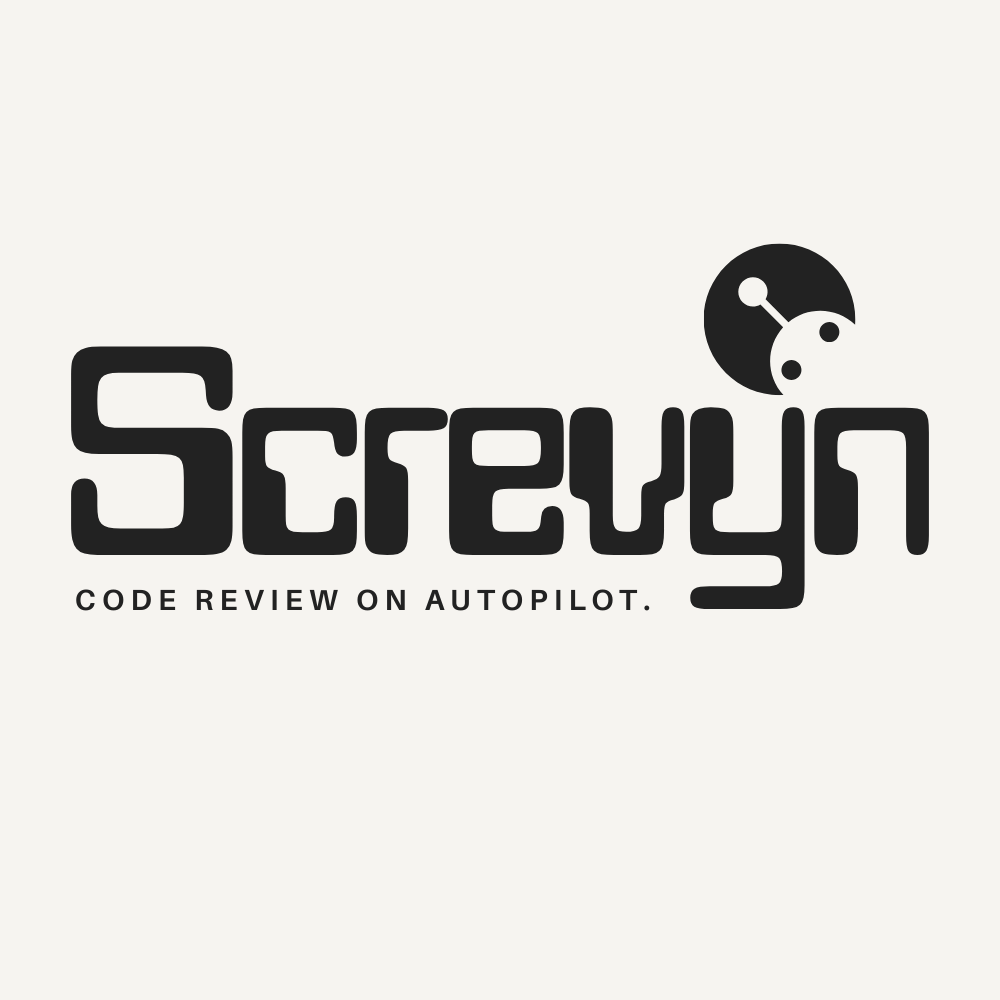

<p align="center">
  
</p>

<p align="center">
  <strong>The AI senior developer that reviews every pull request before a human does.</strong>
</p>

<p align="center">
  <a href="#how-it-works">How it works</a> •
  <a href="#quick-start">Quick start</a> •
  <a href="#architecture">Architecture</a> •
  <a href="#demo">Demo</a> •
  <a href="#contributing">Contributing</a>
</p>

<p align="center">
  
  
  
  
  
</p>

---

## What is Screvyn?

Screvyn is a **multi-agent AI code review system** that catches security holes, performance bugs, and architectural issues — automatically on every pull request.

Four specialist agents run in parallel, each analyzing your code from a different angle, then deliver severity-ranked findings with ready-to-use fixes directly on your PR.

**What makes it different from Copilot / CodeRabbit / PR-Agent:**

- **Multi-agent pipeline** — 4 specialist agents, not a single LLM call
- **AST-aware analysis** — tree-sitter parses code structure, not just text
- **P0/P1/P2 severity ranking** — like a real engineering team's triage
- **Human-tone reviews** — reads like a senior engineer, not a robot
- **Notification fan-out** — GitHub comment + Slack + Teams + Email simultaneously

---
## Architecture

<p align="center">
  
</p>
---

## Demo

<p align="center">
  
</p>

> Push code → Screvyn reviews it in ~25 seconds → findings appear on your PR with severity rankings, explanations, and fixes.

---

## How it works

```
git push / PR opened
       ↓
GitHub Webhook (HMAC-SHA256 verified)
       ↓
FastAPI receives → Celery enqueues (returns 202 in <200ms)
       ↓
Celery worker picks up job
       ↓
tree-sitter AST parsing
  → Language detection (Python, JavaScript, Java)
  → Extract functions, classes, imports, line ranges
       ↓
LangGraph orchestrator — 4 agents run IN PARALLEL
  ├── Security Agent    (OWASP Top 10, secrets, injections)
  ├── Performance Agent (N+1 queries, O(n²), memory leaks)
  ├── Code Smell Agent  (dead code, magic numbers, god classes)
  └── Architecture Agent (SOLID violations, coupling, patterns)
       ↓
Severity Aggregator
  → Deduplicate overlapping findings
  → Rank: P0 (blocking) / P1 (important) / P2 (nit)
       ↓
Output — all fire simultaneously
  ├── GitHub PR comment (Markdown, severity-ranked)
  ├── Slack notification (Block Kit)
  ├── Teams notification (Adaptive Card)
  └── Email alert (P0 + P1 only)
```

---

## Quick start

### Prerequisites

- Python 3.12+
- A [Gemini API key](https://aistudio.google.com/apikey) (free tier works)
- A GitHub App (for webhook + PR comments)
- Upstash Redis (free tier)

### 1. Clone and install

```bash
git clone https://github.com/Vatsalya2003/screvyn_multi-agent-code-review-system.git
cd screvyn_multi-agent-code-review-system/backend
python -m venv venv
source venv/bin/activate
pip install -r requirements.txt
```

### 2. Configure environment

```bash
cp .env.example .env
# Edit .env with your API keys
```

### 3. Run tests

```bash
pytest tests/ -v
# 148+ tests, all green, <1 second
```

### 4. Start the server

```bash
# Terminal 1: Celery worker
celery -A celery_app worker --loglevel=info --concurrency=2

# Terminal 2: FastAPI
uvicorn main:app --reload --port 8000
```

### 5. Try a manual review

```bash
curl -s -X POST http://localhost:8000/api/review \
  -H "Content-Type: application/json" \
  -d '{"code": "import sqlite3\ndef get_user(uid):\n    return sqlite3.connect(\"db\").execute(f\"SELECT * FROM users WHERE id={uid}\")", "language": "python"}' | python -m json.tool
```

---

## Architecture

### Tech stack

| Layer | Technology | Why |
|---|---|---|
| API | FastAPI | Async, auto-generated docs, Pydantic validation |
| LLM | Gemini API (2.5 Flash) | Free tier, fast, structured JSON output |
| Orchestration | LangGraph | Parallel agent execution with shared state |
| AST Parsing | tree-sitter | Same parser as VS Code, supports 50+ languages |
| Job Queue | Celery + Redis | Async processing, GitHub never times out |
| Auth | GitHub App (JWT) | Bot identity, installation tokens, webhook verification |
| Rate Limiting | Redis INCR | Atomic, per-repo monthly counters |
| CI | GitHub Actions | Tests on every push, secret scanning |

### Agent system

Each agent is a specialist with its own system prompt:

| Agent | Catches | Example |
|---|---|---|
| **Security** | OWASP Top 10, leaked secrets | SQL injection, hardcoded API keys |
| **Performance** | Slow code, wasteful patterns | N+1 queries, O(n²) loops |
| **Code Smell** | Maintainability issues | God classes, magic numbers, dead code |
| **Architecture** | Design violations | SOLID violations, tight coupling |

### Severity levels

| Level | Label | Meaning |
|---|---|---|
| **P0** | blocking | Must fix before merge. Security vulnerabilities, data loss risks. |
| **P1** | important | Should fix before merge. Performance issues, design violations. |
| **P2** | nit | Fix when you can. Style issues, minor improvements. |

---

## Project structure

```
screvyn/
├── backend/
│   ├── main.py                     # FastAPI entry point
│   ├── celery_app.py               # Celery + Redis configuration
│   ├── agents/
│   │   ├── orchestrator.py         # LangGraph parallel execution
│   │   ├── security_agent.py       # OWASP, secrets, injections
│   │   ├── performance_agent.py    # N+1, complexity, memory
│   │   ├── smell_agent.py          # Dead code, naming, duplication
│   │   └── architecture_agent.py   # SOLID, coupling, patterns
│   ├── core/
│   │   ├── ast_parser.py           # tree-sitter parsing
│   │   ├── config.py               # Centralized settings
│   │   ├── github_client.py        # GitHub App JWT auth + API
│   │   ├── llm_client.py           # Gemini API wrapper
│   │   ├── rate_limiter.py         # Redis-based rate limiting
│   │   ├── review_style.py         # Human-tone writing rules
│   │   └── severity.py             # Dedup + severity aggregation
│   ├── notifications/
│   │   ├── github_comment_formatter.py
│   │   ├── slack.py
│   │   ├── teams.py
│   │   └── email_notify.py
│   ├── routers/
│   │   ├── reviews.py              # POST /api/review
│   │   └── webhook.py              # POST /api/webhook
│   ├── tasks/
│   │   └── review_task.py          # Async Celery review pipeline
│   └── tests/                      # 148+ unit tests
├── frontend/                       # Next.js dashboard (Phase 8)
└── docs/
```

---

## API

### `POST /api/review` — Manual review

```json
// Request
{ "code": "your code here", "language": "python" }

// Response
{
  "repo": "paste/anonymous",
  "findings": [...],
  "p0_count": 1, "p1_count": 2, "p2_count": 3,
  "agents_completed": ["security", "performance", "smell", "architecture"],
  "review_duration_seconds": 24.5
}
```

### `POST /api/webhook` — GitHub webhook

Receives `pull_request` events, verifies HMAC signature, enqueues async review.
Returns `202 Accepted` immediately.

### `GET /` — Health check

```json
{ "status": "ok", "service": "screvyn", "version": "0.2.0" }
```

---

## Contributing

See [CONTRIBUTING.md](docs/CONTRIBUTING.md) for setup instructions.

**Good first issues:**
- Add a new language to the AST parser (Rust, Go, TypeScript)
- Improve agent prompts with better examples
- Add new notification channels (Discord, PagerDuty)
- Build a VS Code extension

---

## Roadmap

- [x] Gemini integration + Pydantic models
- [x] Security agent + FastAPI endpoint
- [x] tree-sitter AST parser (Python, JS, Java)
- [x] 4 parallel agents + LangGraph orchestration
- [x] Severity aggregator + deduplication
- [x] Celery + Redis + GitHub webhook + PR comments
- [ ] Slack + Teams + Email notifications
- [ ] Next.js dashboard + Firebase

---

## License

[AGPL-3.0](LICENSE) — free for personal and open-source use. Commercial license available for companies that don't want to open-source their modifications.

---

<p align="center">
  <sub>Built by <a href="https://github.com/Vatsalya2003">Vatsalya Dabhi</a></sub>
</p>